# SwingInspire

To run This Project You must do the following:

1. Resolve missing sql jar by selecting it from src/jar directory
2. Start Apache and Mysql using Xampp
3. Goto phpmyadmin create a new database named game and import the game.sql file from src/game.sql
4. Create a new user account to login
# Screenshots

<b> Login </b>
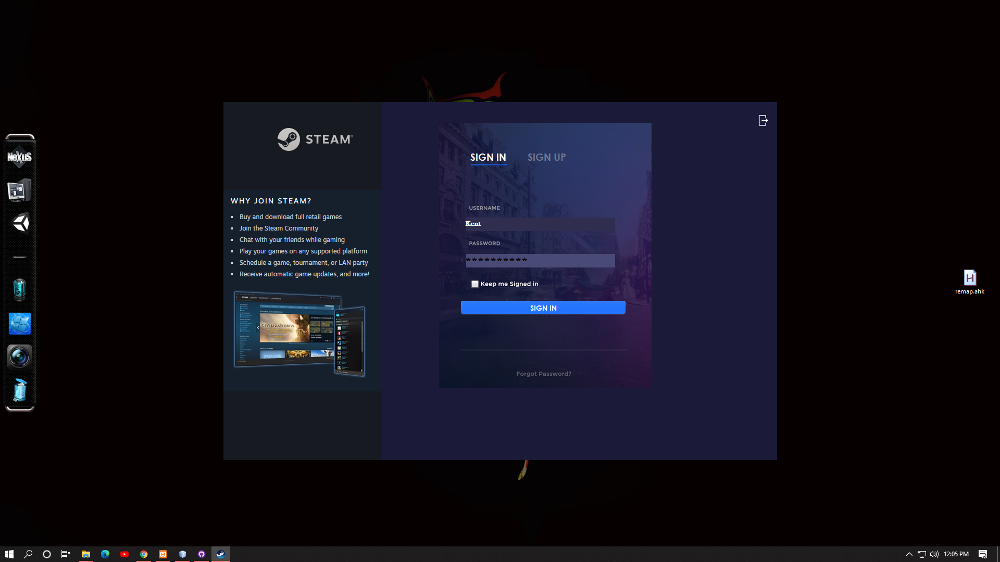

<b> Register </b>
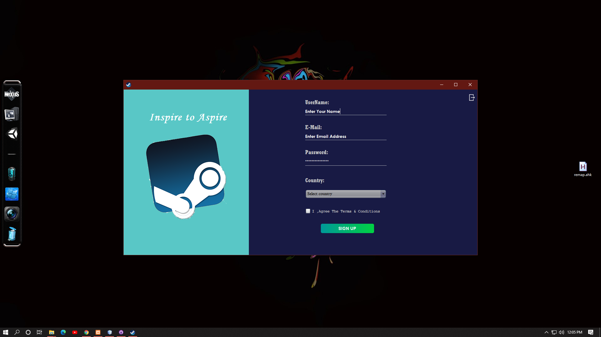

<b> Profile </b>
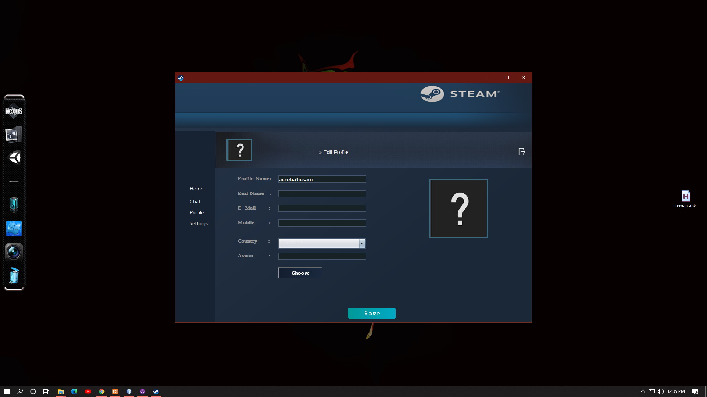

<b> Chat </b>

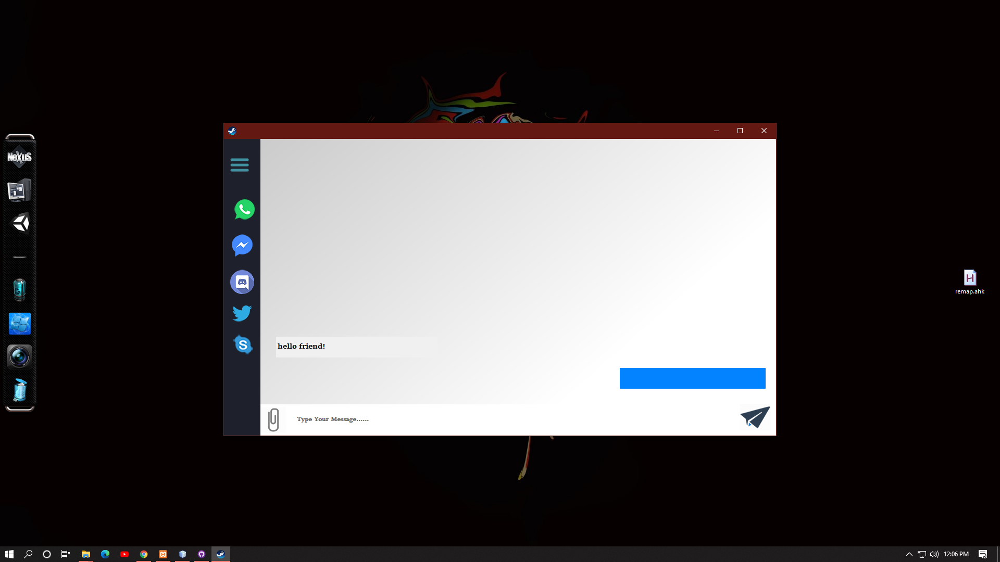

<b> Store </b>

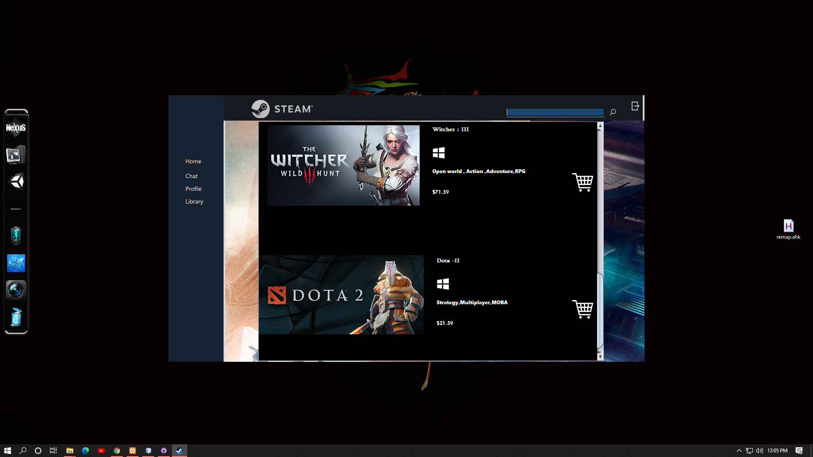

<b> Library </b>

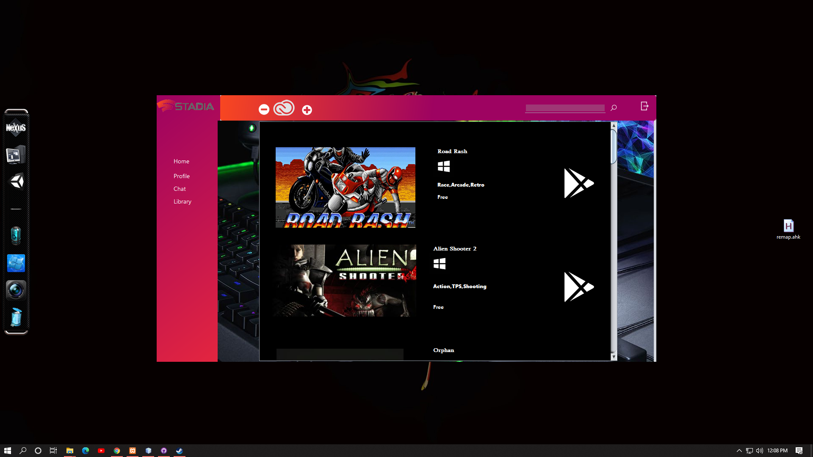
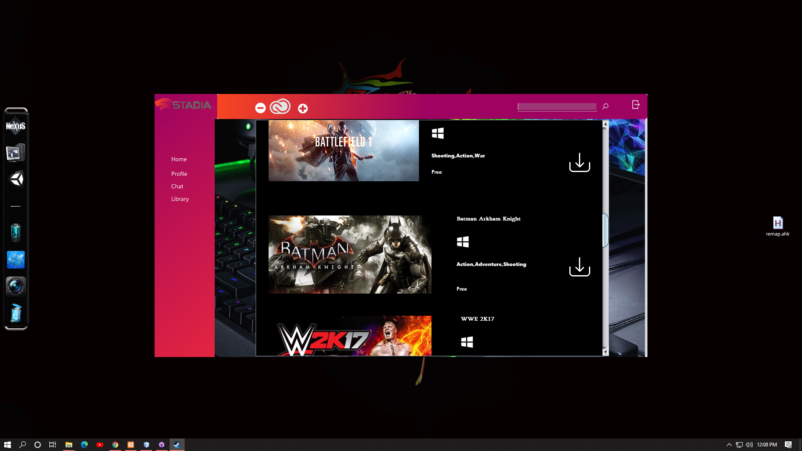

<b> Detailed </b>
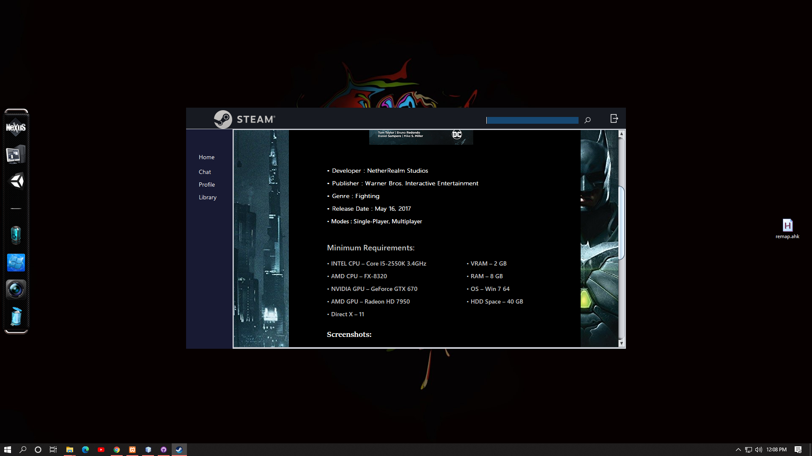
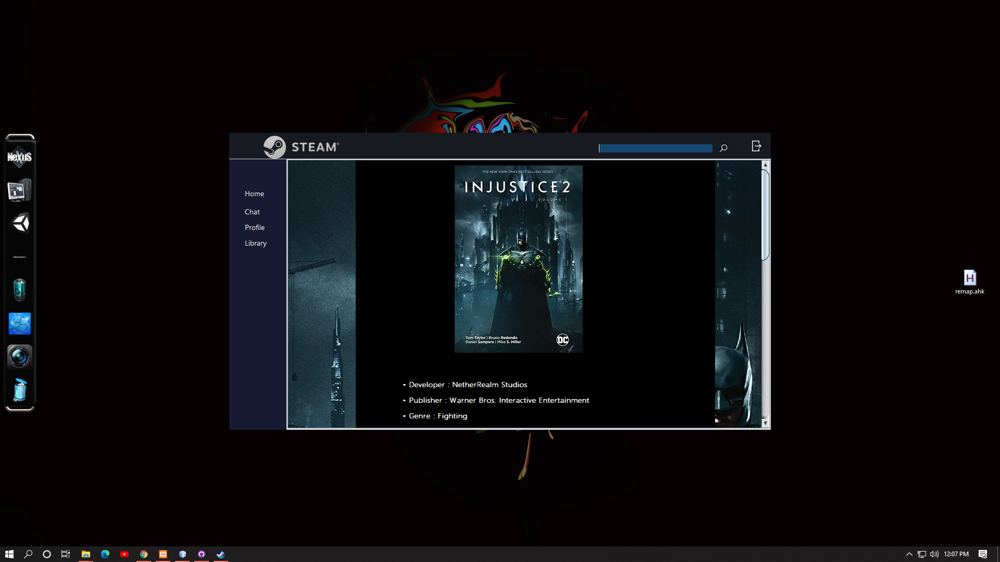

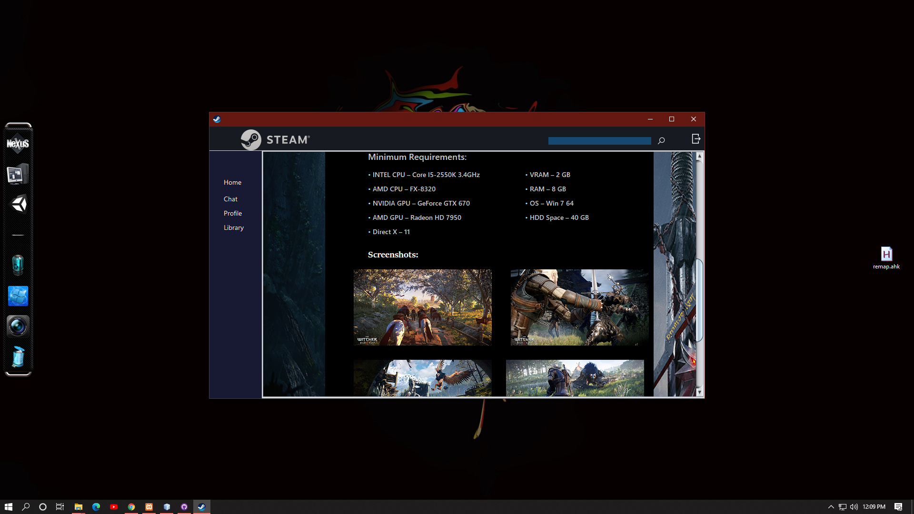
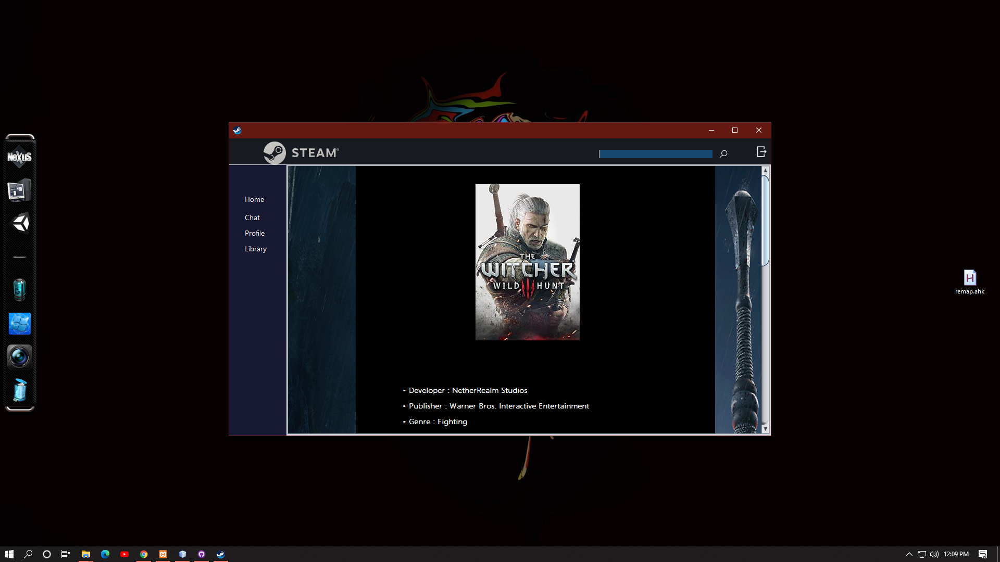
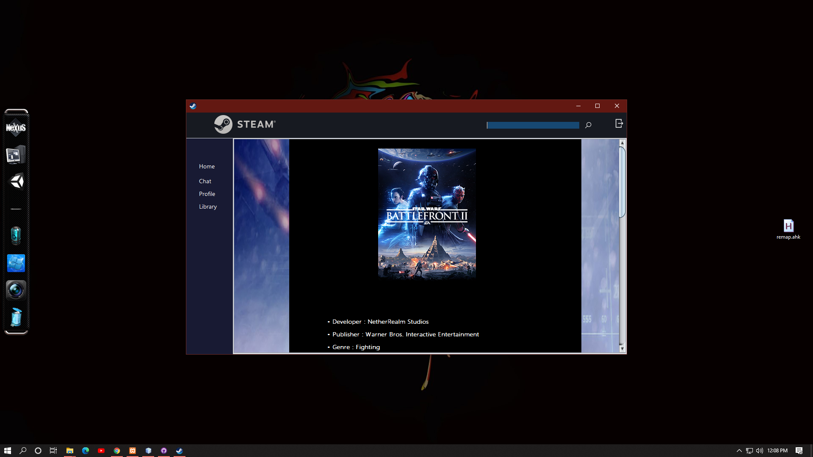
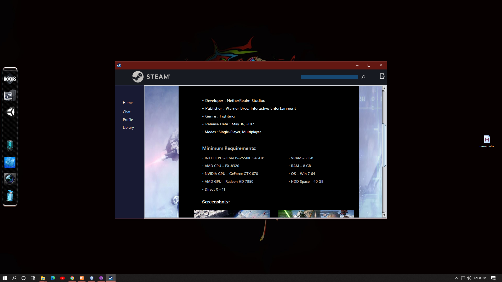
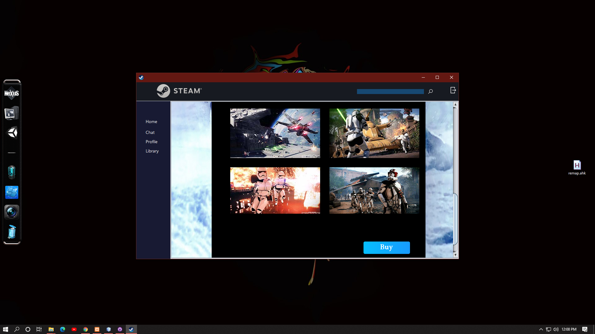
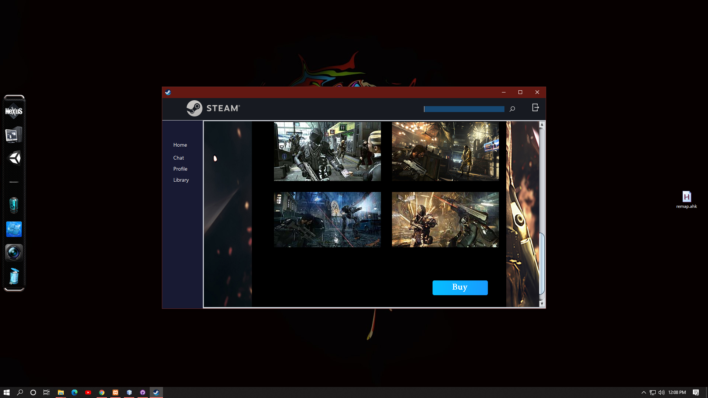
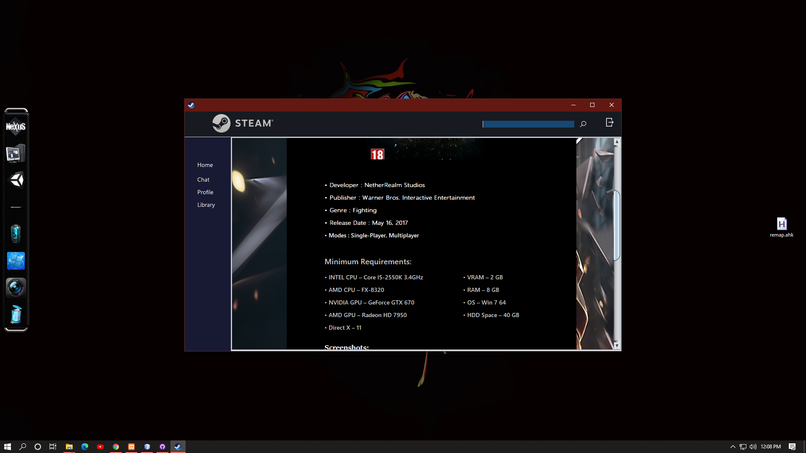
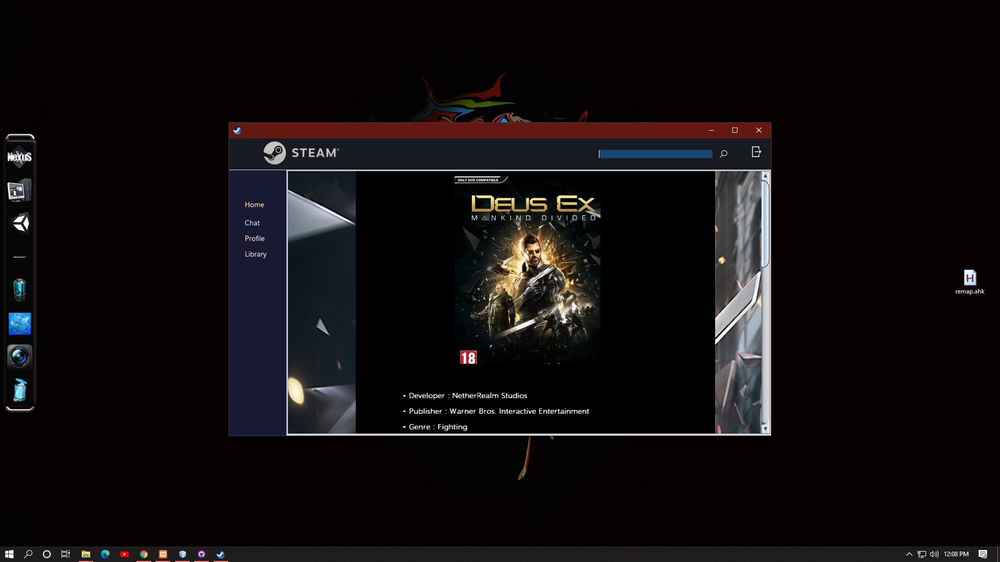

# Short Demo(Click to view)

